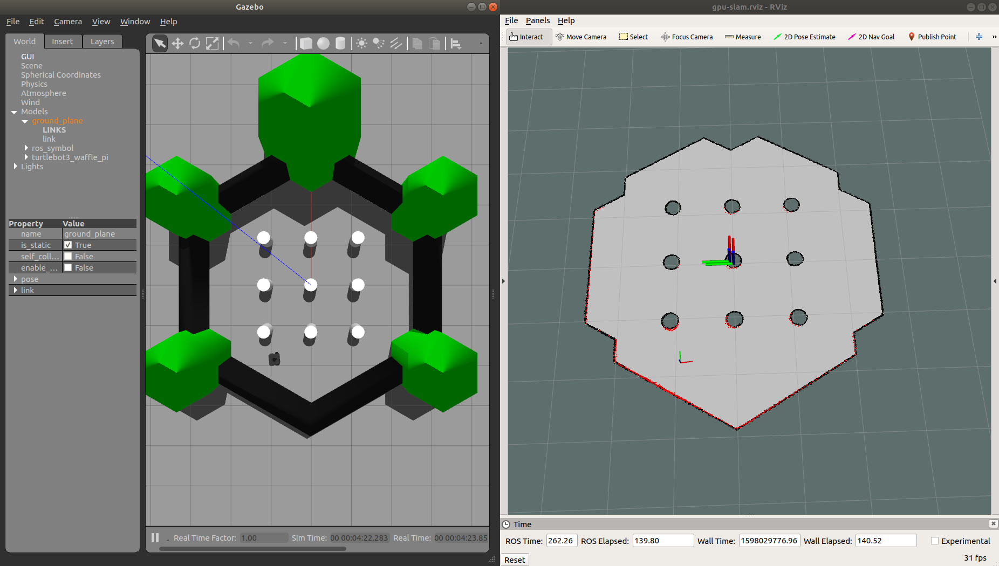

# GPU Slam

A CUDA implementation of slam algorithm.

## Usage

This project is built with ROS Melodic on Ubuntu 18.04.1. However, other versions should work as well.

### Preparing simulation environment

In the first terminal tab:

```bash
sudo apt-get install ros-melodic-turtlebot3-gazebo
sudo apt-get install ros-melodic-turtlebot3-description
sudo apt-get install ros-melodic-turtlebot3-teleop

export TURTLEBOT3_MODEL=waffle_pi
roslaunch turtlebot3_gazebo turtlebot3_world.launch
```
In the second terminal tab:

```bash
export TURTLEBOT3_MODEL=waffle_pi
roslaunch turtlebot3_teleop turtlebot3_teleop_key.launch
```

> **WARNING**: Do not move or send any velocity command to the robot until you see the following line in the gpu-slam terminal: **Initializing: Done. Ready to move**

### Launching gpu slam

```bash
roslaunch gpu-slam gpu-slam.launch
```

### Launching gpu slam

```bash
export TURTLEBOT3_MODEL=waffle_pi
roslaunch turtlebot3_slam turtlebot3_slam.launch
```


## Result

<p align="center">
  
</p>

## Parameters

| Parameter | Default | Explanation |
| - | - | - |
| map_frame | map | Name of map frame |
| odom_frame | odom |Name of odometry frame |
| urbase_frame | urbase_link | Name of un-rotated base frame. This is the base frame of local map |
| base_frame | base_footprint | Name of base frame |
| laser_frame | base_scan | Name of laser frame |
| laser_topic | scan |Name of laser topic to subscribe |
| particle_topic | particles | Name of topic where particles are published |
| map_to_odom_publish_period | 0.1s | Map to odometry publish interval |
| map_to_urbase_pl_period | 0.1s | Map to un-rotated base frame publish interval|
| global_map_publish_period | 1s | Global map publish interval |
| local_map_publish_period | 0.5s | Local map publish interval |
| particle_pl_period | 0.5s | Particle publish interval |
| particle_count | 5 particles | Number of particles used in the filter |
| initialization_scan | 30 scans | Number of very first scan used to construct initial global map. Do not move or send velocity command to the robot in this stage |
| x_x | 0.01 m |Error factor in x axis caused by x movement |
| x_y | 0.01 m | Error factor in x axis caused by y movement |
| x_r | 0.01 m | Error factor in x axis caused by r movement |
| y_x | 0.01 m | Error factor in y axis caused by x movement |
| y_y | 0.01 m | Error factor in y axis caused by y movement |
| y_r | 0.01 m | Error factor in y axis caused by r movement |
| r_x | 0.01 m | Error factor in r axis caused by x movement |
| r_y | 0.01 m | Error factor in r axis caused by y movement |
| r_r | 0.01 m | Error factor in r axis caused by r movement |
| min_range | 0.1 m | Laser min range for a valid range |
| max_range | 3.5 m | Laser max range for a valid range |
| corr_iter_thresh_num | 5 iterations | Number of iterations in correction step |
| kernel_size_m | 0.1 m | Region around ending point to find correspondance |
| neff_thresh | 0.5 | Do resample when neff < neff_thresh |
| dx_resample_thresh | 1 m | Do resample when accumulated movement in x axis exceed this threshold |
| dy_resample_thresh | 1 m | Do resample when accumulated movement in y axis exceed this threshold |
| dt_resample_thresh | 1 m | Do resample when accumulated movement in theta axis exceed this threshold |
| initial_global_map_width | 20 m | Initial global map width in meter |
| initial_global_map_height | 20 m | Initial global map height in meter |
| initial_local_map_width | 10 m | Initial local map width in meter |
| initial_local_map_height | 10 m | Initial local map height in meter |
| m_per_cell | 0.05 m | Size of a square cell in meter |
| true_positive | 0.9 | Probability of occupied cell is measured to be occupied |
| true_negative | 0.5 | Probability of un-occupied cell is measured to be un-occupied |
| w_thresh | 0.3 | Only update map when weight of particle larger than this threshold |
| dx_map_update_thresh | 0.02 m | Do map update only when movement in x axis exceed this threshold |
| dy_map_update_thresh | 0.02 m | Do map update only when movement in y axis exceed this threshold |
| dt_map_update_thresh | 0.02 m | Do map update only when movement in theta axis exceed this threshold |

## License & copyright

@ Van Tuan Ngo, Ho Chi Minh City University of Technology

Licensed under the [MIT license](LICENSE)